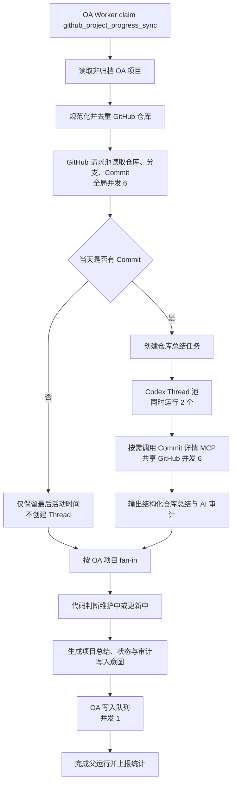

# GitHub 项目进度仓库级并发规划

## 目标

将 `github_project_progress_sync` 从“按项目、按仓库、按总结串行执行”改造为仓库级并发执行，同时保持现有业务边界：

- 仓库任务数量由当天实际有 Commit 的仓库数量决定；
- 每个当天有 Commit 的仓库启动一个独立 Codex Thread；
- 同时最多运行 2 个 Codex Thread，其余仓库任务排队；
- GitHub HTTP 请求全局最多并发 6 个；
- OA 业务写入全局最多并发 1 个；
- 项目状态继续由确定性代码判断，提示词和 Agent 无权决定或修改状态；
- 读取项目、读取 GitHub、生成每日总结、判断状态、写入总结/状态/审计的完整流程只绑定到 `github_project_progress_sync`。

本次只替换 `github_project_progress_sync` 的内部执行策略，不新增任务类型，不改变调度、claim、租约和任务启停协议。

## 固定并发参数

| 资源 | 并发值 | 含义 |
| --- | ---: | --- |
| 仓库任务数量 | 动态 | 当天实际有 Commit 的唯一 GitHub 仓库数 |
| Codex Thread | 每仓库 1 个 | 一个 Thread 汇总该仓库当天全部 Commit |
| Codex Thread 并发 | 2 | 任意时刻最多两个仓库正在使用模型和 Agent 工具 |
| GitHub 读取并发 | 6 | Worker 内所有 GitHub API 请求共享同一个全局信号量 |
| OA 写入并发 | 1 | Commit 总结、项目状态、运行结果和 AI 审计逐个写入 |

这里的“同时运行数量 2”不是启动两个 OAagent 服务，也不是启动两个 Worker 容器，而是一个 Worker 进程内部最多存在两个活跃的仓库总结 Thread。

```text
1 个 OAagent Worker
├── GitHub 请求池：最多 6 个请求
├── 仓库任务队列：N 个当天活跃仓库
├── Codex Thread 池：最多 2 个活跃 Thread
└── OA 写入队列：最多 1 个写请求
```

## 业务语义

### 仓库任务的定义

仓库以规范化后的 `owner/repository` 作为唯一键。先读取所有非归档项目及其关联仓库，再读取仓库快照；只有在 `Asia/Shanghai` 当天存在 Commit 的仓库才进入 Codex Thread 队列。

- 一个仓库当天有 1 条或 100 条 Commit，都只创建 1 个 Thread；
- 一个仓库当天没有 Commit，不创建 Thread；
- 同一个仓库被多个 OA 项目引用时，只读取和总结一次，结果分发给所有关联项目；
- OA 归档项目不读取项目仓库；
- GitHub 已归档仓库按现有 GitHub Reader 规则处理，不扩大读取范围；
- Commit 仍按当前规则读取全部可见分支并按 SHA 去重。

### 无 Commit 仓库仍参与状态判断

“不创建 Codex Thread”不等于“忽略仓库”。为了正确执行 10 天无 Commit 自动转为维护中的规则，所有有效仓库都必须读取最后活动时间：

- 当天有 Commit：进入 Thread 队列，并可使维护中的项目恢复为更新中；
- 当天无 Commit，但最近 240 小时内有活动：不生成总结，项目保持当前状态；
- 所有仓库均超过 240 小时无活动：代码可将项目切换为维护中；
- 任意仓库读取不完整：该项目本轮标记为 `incomplete`，不修改状态和总结，避免错误降级。

### 多仓库项目的合并规则

每个仓库 Thread 输出结构化仓库结果，父任务等待项目关联的全部仓库任务完成后执行 fan-in：

1. 按仓库全名稳定排序；
2. 汇总 Commit 数、来源摘要和限制说明；
3. 将各仓库的一句话总结合并为一条项目当日总结；
4. 使用项目全部 Commit 计算原有 `sourceDigest`；
5. 同一 `project_id + summary_date` 仍只 upsert 一条 OA 项目总结。

首期不再额外启动“项目汇总 Thread”，避免实际 Thread 数超过“每仓库一个”。项目级文本通过确定性模板合并仓库结果；后续如确实需要二次润色，应作为单独配置能力评审，而不是隐式增加模型调用。

## 目标执行链路



## 代码改造设计

### 1. 增加并发配置

在 `ProjectProgressConfig` 增加：

```env
PROJECT_PROGRESS_GITHUB_CONCURRENCY=6
PROJECT_PROGRESS_AGENT_CONCURRENCY=2
PROJECT_PROGRESS_OA_WRITE_CONCURRENCY=1
PROJECT_PROGRESS_WORKSPACE_ROOT=/app/.context/project-progress-workspaces
```

校验规则：

- 三个并发值必须是正整数；
- GitHub 并发建议限制为 `1-20`；
- Agent 并发建议限制为 `1-4`，默认 2；
- OA 写入并发当前必须等于 1，配置其他值直接启动失败，而不是静默降级；
- 工作区根目录必须位于应用可写目录内，不能使用仓库根目录或用户主目录作为清理目标。

需要同步更新 `.env.example`、运行手册、Docker Compose 和 CI/CD 环境变量说明。四项都属于非敏感配置，不应存入 GitHub Secrets；使用 Variables 或部署配置即可。

### 2. 实现共享有界并发器

在 application/infrastructure 边界增加无第三方依赖的 `Semaphore` 或 `mapWithConcurrency`：

- `githubLimiter(6)`：包裹 GitHub Reader 的所有 HTTP 请求以及每个 MCP `read_commit_details` 请求；
- `agentLimiter(2)`：包裹 MCP Server 创建、Codex Thread 执行和结果解析的完整生命周期；
- `oaWriteLimiter(1)`：包裹所有 OA mutation，不限制 OA 的 list/get/heartbeat 请求。

并发器必须支持 `AbortSignal`，等待队列在取消、租约丢失或父任务终止时立即拒绝，不再启动新任务。

### 3. 拆分 discovery、fan-out、fan-in、commit

将 `syncProjectProgress` 的大循环拆为四个明确阶段：

```text
discoverProjectsAndRepositories
  -> readRepositorySnapshots
  -> runActiveRepositorySummaries
  -> assembleProjectReports
  -> commitProjectMutations
```

建议新增核心类型：

```ts
type RepositoryWorkItem = {
  repositoryKey: string;
  repositoryId: number;
  fullName: string;
  summaryDate: string;
  commits: NormalizedProjectProgressCommit[];
  linkedProjectIds: number[];
};

type RepositorySummaryResult = {
  repositoryKey: string;
  summaryDate: string;
  commitCount: number;
  sourceDigest: string;
  summary: string;
  limitations: string[];
  interaction?: ProjectProgressAiInteraction;
  status: "succeeded" | "fallback" | "failed" | "cancelled";
};
```

阶段之间只传不可变结果。仓库子任务不能直接修改项目状态、写 OA 或更新父运行状态，避免并发写入导致重复和顺序不确定。

### 4. 将 Summarizer 改为仓库输入

当前 Summarizer 接收项目级 Commit。改造后每次调用只包含一个仓库当天的 Commit：

- prompt 明确当前 `repositoryFullName` 和业务日期；
- Thread 自主选择该仓库中需要深入读取的 Commit；
- MCP 候选 SHA 仅属于当前仓库；
- 每个 Thread 输出一句仓库进展、限制和 interaction；
- 文件名、增删统计和 Patch 摘要仍受现有上限约束；
- 禁止 shell、文件系统、网页、其他 MCP 和 multi-agent 的安全策略保持不变。

`multi_agent=false` 继续保留。这里的并发由父 Worker 管理多个独立 Codex Thread，不使用单个 Thread 内的子 Agent fan-out。

### 5. 隔离每个 Thread 的工作区

为每个运行和仓库创建独立临时目录：

```text
${PROJECT_PROGRESS_WORKSPACE_ROOT}/{run_id}/{repository_hash}/
```

首期不 clone 仓库，因为 Agent 只能通过受限 GitHub MCP 读取 Commit 详情，shell 和文件工具均已禁用。工作区只用于隔离 Codex 会话元数据。

当前 Codex executable 路径由 `workingDirectory/agent/scripts/isolatedCodexExec.mjs` 推导，改造时必须将“应用根目录”和“Thread 工作目录”拆成两个参数：

- `codexExecutablePath`：固定指向 OAagent 镜像内的脚本；
- `threadWorkingDirectory`：指向本次仓库的隔离目录。

成功、失败、超时、取消时均清理仓库目录；只允许清理经过根目录校验且包含当前 `run_id` 的路径。

### 6. 项目状态与写入保持确定性

项目状态判断仍使用所有仓库快照的 `complete` 和 `lastActivityAt`，不读取 Agent 输出：

- 当前维护中且任意仓库有新 Commit：目标状态为更新中；
- 所有仓库 240 小时没有 Commit：目标状态为维护中；
- 其他情况保持原状态；
- 快照不完整时不写状态。

项目的所有仓库总结完成后，父任务才生成写入意图。写入仍使用现有幂等键和 outbox；`oaWriteLimiter(1)` 保证任何时刻只执行一个 mutation。

建议保持当前单项目写入顺序：

1. 更新项目状态；
2. upsert 当日 GitHub Commit 总结；
3. 写入 AI interaction/audit；
4. 上报项目运行结果；
5. 所有项目完成后结束父运行。

若现有 OA 接口对顺序有更严格要求，以接口幂等与事务契约为准，但仍必须保持全局单写。

### 7. 失败、取消与重试

- 单个仓库 GitHub 读取失败：标记所有关联项目为 `incomplete`，其他仓库继续；
- 单个 Codex Thread 失败：沿用确定性总结兜底，并记录 `fallback`，不影响其他仓库；
- Thread 超时：释放 Agent 和 GitHub 并发名额，关闭对应 MCP Server；
- 父任务收到取消或租约丢失：停止启动排队任务，终止在途 Thread，禁止产生新 OA 写入；
- OA 单次写入失败：记录 outbox，项目标记部分失败，父运行返回可重试；
- 重试依赖 `project_id + summary_date + sourceDigest` 幂等，不重复创建总结或状态变更。

首期可继续使用现有项目日总结 draft。第二阶段建议增加 OAagent 本地仓库总结缓存，键为 `repositoryKey + summaryDate + sourceDigest + promptVersion + modelSnapshot`，使父任务重试时只重跑失败或输入变化的仓库。该缓存属于 OAagent 本地 SQLite，不要求 OA 数据库迁移。

## 审计与前端展示

现有 OA 运行记录继续作为父运行。至少补充以下聚合指标：

```json
{
  "repositories_discovered": 20,
  "repositories_with_commits": 8,
  "repository_tasks_succeeded": 7,
  "repository_tasks_fallback": 1,
  "repository_tasks_failed": 0,
  "agent_peak_concurrency": 2,
  "github_peak_concurrency": 6,
  "oa_write_peak_concurrency": 1
}
```

每个仓库的 `interaction` 继续通过现有 AI 审计接口写入：`request_payload_sanitized` 带上 `repository_full_name` 和 `summary_date`，Codex Thread ID 使用现有 `upstream_request_id` 字段，模型快照、工具调用次数、耗时和兜底状态沿用既有字段。

如果前端只需要父任务完成后的仓库审计列表，优先复用现有 interaction/audit 接口，不需要 OA 新表。如果需要实时展示“仓库 A 排队中、仓库 B 运行中、仓库 C 已完成”，OA 需要新增 repository-run 子记录及上报接口；该能力不作为本次并发 MVP 的阻塞项。

## 分阶段实施顺序

### 阶段一：配置和并发基础设施

1. 增加四个环境变量、配置解析和边界校验；
2. 实现支持取消的共享信号量；
3. 为 GitHub Reader、Commit 详情 MCP 和 OA Writer 注入对应 limiter；
4. 增加并发峰值指标。

退出标准：单元测试可证明三个并发池分别不超过 6、2、1，等待任务取消后不会继续启动。

### 阶段二：仓库任务模型

1. 将项目/仓库发现与总结循环解耦；
2. 按规范仓库名去重并创建动态 `RepositoryWorkItem[]`；
3. 只为当天有 Commit 的仓库创建任务；
4. 将 Summarizer 和 prompt 改为单仓库输入；
5. 拆分 Codex executable 路径和 Thread 工作目录。

退出标准：8 个活跃仓库产生 8 个 Thread ID，但运行时活跃 Thread 峰值为 2；无 Commit 仓库 Thread 数为 0。

### 阶段三：项目聚合和串行写入

1. 将仓库结果 fan-in 到所有关联 OA 项目；
2. 确定性生成单条项目日总结；
3. 保留基于全部仓库快照的状态判断；
4. 通过 OA 单写队列执行总结、状态和审计写入；
5. 保持现有幂等键和 outbox 恢复能力。

退出标准：多仓库项目每天仍只有一条总结；状态判断不依赖 Agent 文本；OA mutation 峰值始终为 1。

### 阶段四：运行审计、部署和灰度

1. 增加仓库数量、队列等待、各池峰值、Thread 耗时和 fallback 指标；
2. 更新 `.env.example`、Compose、CI/CD 和运维文档；
3. 将 Worker 资源从当前 `1 CPU / 1GB` 起步调整为至少 `2 CPU / 3GB`；
4. 先用 `Agent=1、GitHub=2、OA=1` 灰度，再切换到目标 `2/6/1`；
5. 观察 GitHub rate limit、模型限流、内存峰值和 OA 422/5xx 后再固化默认值。

退出标准：连续 5 个工作日无重复总结、无错误状态切换、无租约丢失，且资源峰值在容器限制内。

## 测试矩阵

| 场景 | 预期结果 |
| --- | --- |
| 20 个仓库，仅 8 个当天有 Commit | 创建 8 个仓库任务和 8 个 Thread |
| 8 个仓库任务同时排队 | 活跃 Codex Thread 峰值等于 2 |
| Thread 同时请求 Commit 详情 | 全局 GitHub HTTP 并发不超过 6 |
| 多项目同时产生写入 | OA mutation 并发始终等于 1 |
| 一个项目关联 3 个活跃仓库 | 3 个仓库 Thread，最终 1 条项目日总结 |
| 同一仓库关联 2 个项目 | 仓库只读取、总结一次，结果供两个项目聚合 |
| 仓库当天无 Commit | 不创建 Thread，但参与 10 天状态判断 |
| 维护中项目出现 Commit | 代码将状态改为更新中 |
| 所有仓库超过 240 小时无 Commit | 代码将状态改为维护中 |
| 任意仓库读取不完整 | 项目不写总结和状态，运行可重试 |
| 单个 Agent Thread 失败 | 使用确定性兜底，其他仓库继续 |
| 运行中取消或租约丢失 | 停止排队任务、终止在途 Thread、停止 OA 写入 |
| 同一运行被重试 | 幂等 upsert，不产生重复总结或审计写入 |
| Thread 完成或失败 | MCP Server 关闭，隔离目录被安全清理 |

## 验证命令

实施完成后按从小到大的顺序验证：

```bash
npm test -w agent -- projectProgressConfig
npm test -w agent -- projectProgressAgentSummarizer
npm test -w agent -- syncProjectProgress
npm run typecheck -w agent
npm test -w agent
npm run build -w agent
docker compose config
```

再使用固定时间和测试项目执行 dry-run，检查仓库任务数、Thread ID 数和并发峰值；最后在 OA 测试环境手动触发一次生产写入模式，确认总结、状态和审计闭环。

## 不在本次范围

- 不按 Commit 创建 Thread；
- 不为每个 Thread 启动独立 Worker 或 OAagent 容器；
- 不允许仓库子任务直接写 OA；
- 不让 Agent 根据提示词决定项目状态；
- 不开放其他 `job_type` 使用项目状态和 GitHub 日总结 writer；
- 不在首期 clone 完整仓库或开放 shell/文件系统；
- 不因并发改造修改 OA 的调度、claim、租约或重试协议。

## 回滚策略

发布时保留临时执行策略开关：

```env
PROJECT_PROGRESS_EXECUTION_STRATEGY=project_serial
```

灰度验证后切换为：

```env
PROJECT_PROGRESS_EXECUTION_STRATEGY=repository_parallel
```

如出现模型限流、内存压力或 GitHub rate limit，优先将 Agent 并发降为 1、GitHub 并发降为 2；若仍异常，切回 `project_serial`。OA 数据结构和幂等键保持不变，因此回滚不需要数据库脚本，也不会影响已生成的总结记录。
