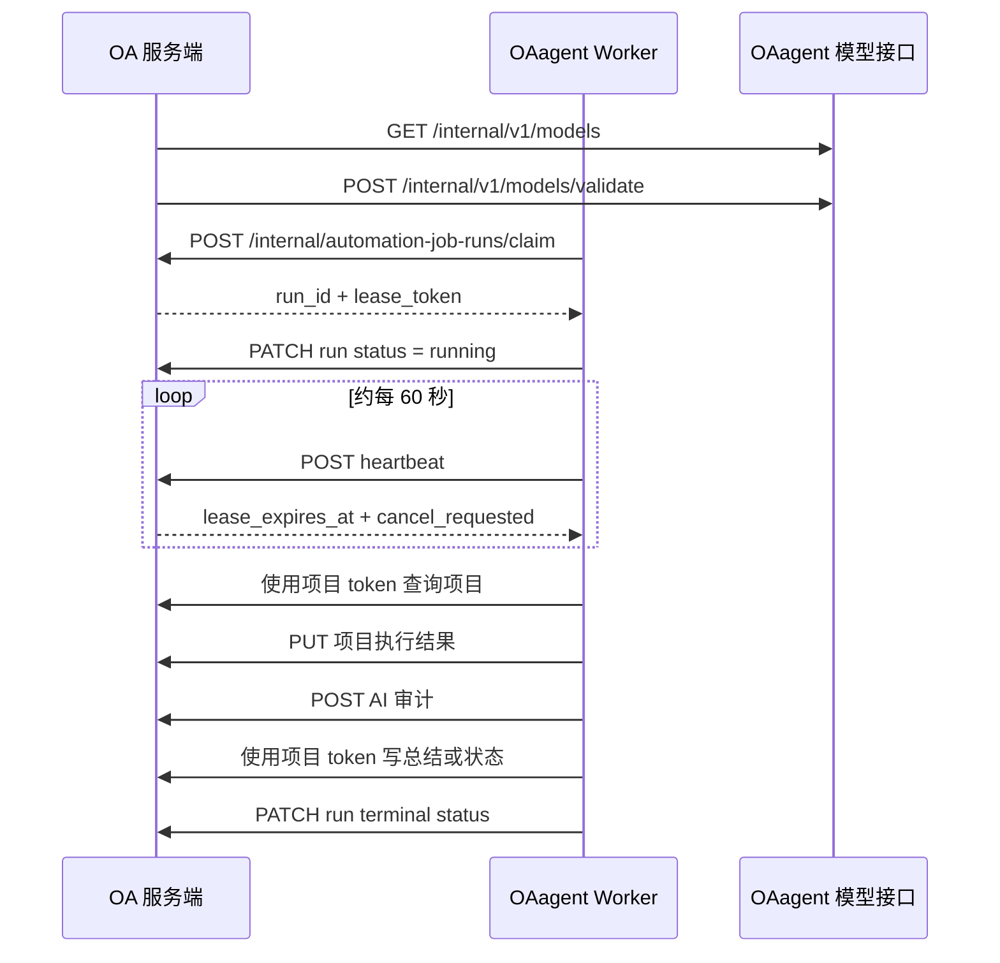

# OAagent 与 OA 自动化联调 API

本文档面向 OAagent 开发和联调，描述当前 OA 服务端自动化任务相关的双向接口契约。

- OA 服务端基准：2026-07-30，提交 `fccdeab`
- 当前支持的任务类型：`github_project_progress_sync`
- 所有示例均使用占位 token，不包含真实密钥
- OA 服务端接口路径没有额外 `/api` 前缀

## 1. 联调地址与认证

建议在联调环境准备以下配置：

```dotenv
OA_BASE_URL=http://127.0.0.1:3002
OAAGENT_BASE_URL=http://127.0.0.1:3001
OA_AGENT_AUTOMATION_TOKEN=replace-with-dedicated-worker-token
OA_PROJECT_SYNC_TOKEN=replace-with-dedicated-project-sync-token
```

OA 服务端对应配置：

```dotenv
OA_AGENT_INTERNAL_BASE_URL=http://127.0.0.1:3001
OA_AGENT_AUTOMATION_TOKEN=replace-with-dedicated-worker-token
OA_PROJECT_SYNC_TOKEN=replace-with-dedicated-project-sync-token
```

两个 token 用途不同，不可互换：

| Token | 使用范围 |
| --- | --- |
| `OA_AGENT_AUTOMATION_TOKEN` | OA 调用 OAagent 模型接口；OAagent 调用 Worker、租约和运行审计接口 |
| `OA_PROJECT_SYNC_TOKEN` | OAagent 查询项目、修改项目状态、读写 GitHub commit 总结 |

所有需要服务认证的请求都使用：

```http
Authorization: Bearer <token>
Content-Type: application/json
```

不要使用 `sessionid=...`，也不要把服务 token 放入 query 参数、日志或审计 payload。

## 2. 双向调用关系

| 方向 | 接口组 | 认证 |
| --- | --- | --- |
| OA → OAagent | `/internal/v1/models*` | `OA_AGENT_AUTOMATION_TOKEN` |
| OAagent → OA | `/internal/automation-job-runs*` | `OA_AGENT_AUTOMATION_TOKEN` |
| OAagent → OA | `/internal/project-sync*` | `OA_PROJECT_SYNC_TOKEN` |

运行 Trace 的新增内部写入与普通用户读取契约见 `docs/automation_run_trace_api.md`。Trace 使用现有 `OA_AGENT_AUTOMATION_TOKEN`，不新增 token。



## 3. 通用响应格式

除 claim 无任务时的 `204 No Content` 外，OA 接口统一返回：

```json
{
  "code": 200,
  "message": "ok",
  "data": {},
  "success": true
}
```

错误响应示例：

```json
{
  "code": 409,
  "message": "租约已过期",
  "data": {
    "error_code": "lease_expired",
    "details": null
  },
  "success": false
}
```

时间约定：

- Worker 和运行审计接口返回 UTC ISO 8601，例如 `2026-07-30T08:00:00Z`
- Worker 上报时间建议携带 `Z` 或明确时区
- `summary_date` 是北京时间业务日期，格式为 `YYYY-MM-DD`
- 项目接口中的 `created_at`、`updated_at` 为 Unix 秒时间戳

## 4. OAagent 需要提供的模型接口

OA 服务端通过 `OA_AGENT_INTERNAL_BASE_URL` 调用以下接口。OAagent 必须使用 `OA_AGENT_AUTOMATION_TOKEN` 校验 Bearer token。

### 4.1 获取模型目录

```http
GET /internal/v1/models
Authorization: Bearer <OA_AGENT_AUTOMATION_TOKEN>
```

成功响应：

```json
{
  "data": {
    "catalog_version": "2026-07-30T08:00:00Z",
    "providers": [
      {
        "provider": "nexttoken",
        "display_name": "NextToken",
        "models": [
          {
            "model_id": "gpt-5.6-terra",
            "display_name": "GPT-5.6 Terra",
            "enabled": true,
            "supports_structured_output": true,
            "is_default": true
          }
        ]
      }
    ]
  }
}
```

字段要求：

| 字段 | 类型 | 必填 | 说明 |
| --- | --- | --- | --- |
| `catalog_version` | string | 是 | 模型目录版本；目录变化时必须变化 |
| `providers[].provider` | string | 是 | 稳定 provider 标识 |
| `providers[].display_name` | string | 是 | 展示名称 |
| `models[].model_id` | string | 是 | 稳定模型标识 |
| `models[].display_name` | string | 是 | 展示名称 |
| `models[].enabled` | boolean | 是 | 当前是否可用 |
| `models[].supports_structured_output` | boolean | 否 | 默认 `false` |
| `models[].is_default` | boolean | 否 | 默认 `false` |

OA 会缓存目录 5 分钟。OAagent 暂时不可用时，OA 最多使用 24 小时的 stale 缓存；任务创建、修改、启用和手动触发仍会实时校验模型。

### 4.2 实时校验模型

```http
POST /internal/v1/models/validate
Authorization: Bearer <OA_AGENT_AUTOMATION_TOKEN>
Content-Type: application/json
```

请求：

```json
{
  "provider": "nexttoken",
  "model_id": "gpt-5.6-terra"
}
```

模型有效：

```json
{
  "data": {
    "valid": true,
    "catalog_version": "2026-07-30T08:00:00Z"
  }
}
```

模型无效可采用以下任一方式：

- 返回 `200`，并令 `data.valid=false`
- 返回 HTTP `404`
- 返回 HTTP `422`

OA 会把以上情况统一识别为 `invalid_model`。其他非 2xx、超时或响应结构错误会识别为 `model_catalog_unavailable`。

## 5. OAagent 调用的 Worker API

### 5.1 抢占任务

```http
POST /internal/automation-job-runs/claim
Authorization: Bearer <OA_AGENT_AUTOMATION_TOKEN>
Content-Type: application/json
```

```json
{
  "worker_instance": "oaagent-worker-01",
  "supported_job_types": ["github_project_progress_sync"],
  "lease_seconds": 300,
  "claim_request_id": "019fd15d-32c6-7fb2-9afb-68be0996b80f"
}
```

约束：

| 字段 | 约束 |
| --- | --- |
| `worker_instance` | 1～255 字符；同一 Worker 生命周期内保持稳定 |
| `supported_job_types` | 1～20 项；当前只能包含 `github_project_progress_sync` |
| `lease_seconds` | 60～600 秒，推荐 300 |
| `claim_request_id` | UUID；首次请求前持久化，同一次未知结果重试必须复用 |

OA 必须在覆盖最大 run 时长和恢复宽限期的幂等窗口内绑定
`claim_request_id + worker_instance + 规范化请求摘要`。同一 ID 和同一请求返回同一
claim；同一 ID 携带不同 worker、任务类型或租约时长时返回
`409 claim_request_conflict`。`204` 或已确认终态后，Worker 才能清除该 ID。

有任务时返回 `200`：

```json
{
  "code": 200,
  "message": "ok",
  "data": {
    "run_id": "7f7dc11f-30b5-482f-a8bf-5ee72b667baf",
    "lease_token": "raw-lease-token-returned-once",
    "run_mutation_token": "scoped-hmac-token",
    "fencing_token": 7,
    "concurrency_key": "tenant-1:github_project_progress_sync:all_projects",
    "job_id": 1,
    "job_key": "github-project-progress-sync",
    "job_type": "github_project_progress_sync",
    "name": "GitHub 项目进度每日总结",
    "description": "读取 OA 项目关联的 GitHub 仓库并生成进度总结",
    "tags": [
      {"id": 1, "name": "GitHub", "color": "#24292f"}
    ],
    "trigger_source": "schedule",
    "scheduled_at": "2026-07-30T12:00:00Z",
    "timezone": "Asia/Shanghai",
    "model_provider": "nexttoken",
    "model_id": "gpt-5.6-terra",
    "model_parameters": {},
    "model_catalog_version": "2026-07-30T08:00:00Z",
    "retry_policy": {
      "attempt": 1,
      "max_attempts": 3,
      "interval_seconds": 300
    },
    "timeout_seconds": 2700,
    "deadline_at": "2026-07-30T12:45:00Z",
    "lease_expires_at": "2026-07-30T12:05:00Z",
    "cancel_requested": false
  },
  "success": true
}
```

无可执行任务时返回：

```http
HTTP/1.1 204 No Content
```

`204` 没有 JSON body，不应按错误处理。`lease_token` 和
`run_mutation_token` 只能驻留当前运行内存，不得写 SQLite 或日志。OA 使用服务端
HMAC 按 `run_id + worker_instance + concurrency_key + fencing_token + token_version`
确定性派生 scoped token，因此相同 claim request 可以安全返回相同凭证。

cURL：

```bash
curl --request POST "$OA_BASE_URL/internal/automation-job-runs/claim" \
  --header "Authorization: Bearer $OA_AGENT_AUTOMATION_TOKEN" \
  --header "Content-Type: application/json" \
  --data '{
    "worker_instance": "oaagent-worker-01",
    "supported_job_types": ["github_project_progress_sync"],
    "lease_seconds": 300,
    "claim_request_id": "019fd15d-32c6-7fb2-9afb-68be0996b80f"
  }'
```

### 5.2 Run-scoped mutation 公共字段

除 heartbeat 外，运行状态、项目执行结果、AI 审计和 Trace 写入都必须携带：

```json
{
  "run_id": "7f7dc11f-30b5-482f-a8bf-5ee72b667baf",
  "run_mutation_token": "scoped-hmac-token",
  "fencing_token": 7,
  "idempotency_key": "sha256:64-hex-characters"
}
```

`idempotency_key` 由 `run_id + 稳定 operation + canonical JSON payload` 生成，不含
lease token 或 scoped token。OA 必须在同一个数据库事务内依次验证 token scope、当前
lease/fence、幂等键与 payload hash，再对首次 mutation 执行条件写。相同 key 和相同
payload 返回原结果；相同 key 和不同 payload 返回 `409 idempotency_conflict`。

### 5.3 标记运行中或回传终态

```http
PATCH /internal/automation-job-runs/{run_id}
Authorization: Bearer <OA_AGENT_AUTOMATION_TOKEN>
Content-Type: application/json
```

claim 成功后，OAagent 应先标记 `running`：

```json
{
  "worker_instance": "oaagent-worker-01",
  "lease_token": "raw-lease-token-returned-once",
  "run_id": "7f7dc11f-30b5-482f-a8bf-5ee72b667baf",
  "run_mutation_token": "scoped-hmac-token",
  "fencing_token": 7,
  "idempotency_key": "sha256:64-hex-characters",
  "status": "running"
}
```

任务完成后上报终态：

```json
{
  "worker_instance": "oaagent-worker-01",
  "lease_token": "raw-lease-token-returned-once",
  "run_id": "7f7dc11f-30b5-482f-a8bf-5ee72b667baf",
  "run_mutation_token": "scoped-hmac-token",
  "fencing_token": 7,
  "idempotency_key": "sha256:64-hex-characters",
  "status": "partial_failed",
  "mutations_applied": true,
  "retry_recommended": true,
  "error_code": "project_processing_partial_failed",
  "error_summary": "3 个项目中 1 个处理失败"
}
```

状态流转：

| 当前状态 | 允许上报 |
| --- | --- |
| `claimed` | `running`、`configuration_error`、`failed`、`cancelled` |
| `running` | `succeeded`、`partial_failed`、`failed`、`configuration_error`、`cancelled` |

终态成功响应：

```json
{
  "code": 200,
  "message": "ok",
  "data": {
    "run": {
      "id": "7f7dc11f-30b5-482f-a8bf-5ee72b667baf",
      "status": "partial_failed",
      "projects_total": 3,
      "projects_succeeded": 2,
      "projects_failed": 1,
      "mutations_applied": true,
      "retry_recommended": true,
      "finished_at": "2026-07-30T12:12:00Z",
      "duration_ms": 720000
    },
    "retry_run_id": "be03af3d-c975-4f89-a43a-e21815b4e527"
  },
  "success": true
}
```

说明：

- `projects_total`、`projects_succeeded`、`projects_failed` 和 `duration_ms` 由 OA 根据项目执行记录计算
- `failed` 或 `partial_failed` 且 `retry_recommended=true` 时，OA 会按快照策略创建重试运行
- 相同终态和相同内容可安全重放；终态内容不一致返回 `409`
- 终态事务必须锁定 run，并作为 barrier 使旧 token/fence 失效
- `error_summary` 最长 1000 字符，不要包含 token、请求头、Cookie 或完整上游响应

### 5.4 心跳续租

```http
POST /internal/automation-job-runs/{run_id}/heartbeat
Authorization: Bearer <OA_AGENT_AUTOMATION_TOKEN>
Content-Type: application/json
```

```json
{
  "worker_instance": "oaagent-worker-01",
  "lease_token": "raw-lease-token-returned-once",
  "lease_seconds": 300
}
```

`lease_seconds` 可省略，省略后沿用当前租约时长。推荐每约 60 秒发送一次。

```json
{
  "code": 200,
  "message": "ok",
  "data": {
    "run_id": "7f7dc11f-30b5-482f-a8bf-5ee72b667baf",
    "status": "running",
    "heartbeat_at": "2026-07-30T12:03:00Z",
    "lease_expires_at": "2026-07-30T12:08:00Z",
    "cancel_requested": false
  },
  "success": true
}
```

OAagent 必须处理 `cancel_requested=true`：停止领取新的项目，在安全检查点终止当前工作，并回传 `status=cancelled`。续租时间不会超过 `deadline_at`。

### 5.5 幂等写入项目执行结果

```http
PUT /internal/automation-job-runs/{run_id}/projects/{project_id}
Authorization: Bearer <OA_AGENT_AUTOMATION_TOKEN>
Content-Type: application/json
```

```json
{
  "worker_instance": "oaagent-worker-01",
  "lease_token": "raw-lease-token-returned-once",
  "run_id": "7f7dc11f-30b5-482f-a8bf-5ee72b667baf",
  "run_mutation_token": "scoped-hmac-token",
  "fencing_token": 7,
  "idempotency_key": "sha256:64-hex-characters",
  "project_name_snapshot": "OA 服务端",
  "status_before": "updating",
  "status_after": "maintenance",
  "outcome": "evaluated",
  "repository_count": 2,
  "commit_count": 18,
  "summary_date": "2026-07-30",
  "source_digest": "sha256:example-source-digest",
  "generated_summary": "今日完成自动化任务服务端联调。",
  "ai_confidence": 92,
  "ai_note": "提交记录完整",
  "warnings": [],
  "mutations_applied": true,
  "started_at": "2026-07-30T12:01:00Z",
  "finished_at": "2026-07-30T12:02:30Z",
  "duration_ms": 90000
}
```

`outcome` 枚举：

| 值 | 含义 | OA 成功计数 |
| --- | --- | --- |
| `evaluated` | 已正常评估并生成结果 | 成功 |
| `archived` | 项目已归档，无需继续处理 | 成功 |
| `no_github_urls` | 项目未配置 GitHub 仓库 | 成功 |
| `no_commits` | 仓库读取完成，当天没有新增 Commit | 成功 |
| `invalid_github_urls` | GitHub URL 不合法 | 失败 |
| `incomplete` | 数据或处理结果不完整 | 失败 |
| `write_conflict` | OA 业务写入冲突 | 失败 |
| `failed` | 处理失败 | 失败 |

成功响应：

```json
{
  "code": 200,
  "message": "ok",
  "data": {
    "run_project_id": 123,
    "project_id": 51
  },
  "success": true
}
```

同一 `(run_id, project_id)` 再次 PUT 会覆盖同一记录。OAagent 必须保存返回的 `run_project_id`，创建 AI 审计时需要使用。

### 5.6 幂等写入 AI 调用审计

```http
POST /internal/automation-job-runs/{run_id}/ai-interactions
Authorization: Bearer <OA_AGENT_AUTOMATION_TOKEN>
Content-Type: application/json
```

```json
{
  "worker_instance": "oaagent-worker-01",
  "lease_token": "raw-lease-token-returned-once",
  "run_id": "7f7dc11f-30b5-482f-a8bf-5ee72b667baf",
  "run_mutation_token": "scoped-hmac-token",
  "fencing_token": 7,
  "idempotency_key": "sha256:64-hex-characters",
  "run_project_id": 123,
  "interaction_key": "project-51-summary-v1",
  "provider": "nexttoken",
  "model": "gpt-5.6-terra",
  "model_catalog_version": "2026-07-30T08:00:00Z",
  "prompt_version": "github-project-progress-v1",
  "system_prompt_snapshot": "你是项目进度总结助手。",
  "request_payload_sanitized": {
    "commit_count": 18
  },
  "response_payload_sanitized": {
    "finish_reason": "stop"
  },
  "final_summary": "今日完成自动化任务服务端联调。",
  "limitations": [],
  "fallback_used": false,
  "upstream_request_id": "req-example",
  "input_tokens": 1300,
  "output_tokens": 280,
  "latency_ms": 4200,
  "status": "succeeded",
  "error_code": null,
  "error_summary": null
}
```

`status` 只能是 `succeeded`、`failed` 或 `fallback`。请求模型为 `extra=forbid`，不能发送未定义字段。

```json
{
  "code": 201,
  "message": "created",
  "data": {
    "interaction_id": 456,
    "interaction_key": "project-51-summary-v1"
  },
  "success": true
}
```

同一 `(run_id, interaction_key)` 再次 POST 会更新原记录，不会重复创建。`request_payload_sanitized`、`response_payload_sanitized`、`limitations` 和错误摘要不得包含凭证；OA 还会对常见敏感 key 做二次脱敏。

## 6. OAagent 调用的项目同步 API

本组接口统一使用：

```http
Authorization: Bearer <OA_PROJECT_SYNC_TOKEN>
```

该 token 只能访问项目列表、详情、状态修改和 commit 总结，不提供项目删除、参与人修改、Issue、里程碑或任意项目字段更新。

### 6.1 项目列表

```http
GET /internal/project-sync/projects?page=1&size=100
```

| 参数 | 默认值 | 约束 |
| --- | --- | --- |
| `page` | 1 | 大于等于 1 |
| `size` | 100 | 1～500 |

```json
{
  "code": 200,
  "message": "ok",
  "data": {
    "total": 1,
    "items": [
      {
        "id": 51,
        "created_by": 8,
        "created_at": 1785398400,
        "people": [8, 12],
        "project_name": "OA 服务端",
        "status": "updating",
        "describe": "OA 服务端项目",
        "softforge_id": 3,
        "github_urls": ["https://github.com/example/rwoachat"],
        "version": 12
      }
    ]
  },
  "success": true
}
```

cURL：

```bash
curl "$OA_BASE_URL/internal/project-sync/projects?page=1&size=100" \
  --header "Authorization: Bearer $OA_PROJECT_SYNC_TOKEN"
```

### 6.2 项目详情

```http
GET /internal/project-sync/projects/{project_id}
```

成功时 `data` 包含：

```json
{
  "id": 51,
  "created_by": 8,
  "created_at": 1785398400,
  "updated_at": 1785402000,
  "project_name": "OA 服务端",
  "describe": "OA 服务端项目",
  "softforge_id": 3,
  "status": "updating",
  "markdown": "",
  "github_urls": ["https://github.com/example/rwoachat"],
  "deleted": false,
  "people": [8, 12],
  "version": 12
}
```

项目不存在或已删除返回 `404 project_not_found`。

### 6.3 修改项目状态

```http
PATCH /internal/project-sync/projects/{project_id}/status
Content-Type: application/json
```

```json
{
  "status": "maintenance",
  "expected_version": 12,
  "run_id": "7f7dc11f-30b5-482f-a8bf-5ee72b667baf",
  "run_mutation_token": "scoped-hmac-token",
  "fencing_token": 7,
  "idempotency_key": "sha256:64-hex-characters"
}
```

`status` 只能是：

- `updating`
- `maintenance`
- `archived`

成功时 `data` 返回更新后的项目详情和递增后的 `version`。`expected_version` 不匹配返回
`409/412 version_conflict`，旧 token/fence 返回 `409`，项目不存在或已删除返回
`404 project_not_found`。

### 6.4 查询 GitHub commit 总结

```http
GET /internal/project-sync/github-commit-summaries?project_id=51&page=1&size=100&summary_date=2026-07-30
```

| 参数 | 必填 | 默认值/约束 |
| --- | --- | --- |
| `project_id` | 是 | 整数 |
| `page` | 否 | 默认 1，大于等于 1 |
| `size` | 否 | 默认 100，1～500 |
| `summary_date` | 否 | `YYYY-MM-DD`，北京时间业务日期 |

```json
{
  "code": 200,
  "message": "ok",
  "data": {
    "total": 1,
    "items": [
      {
        "id": 81,
        "project_id": 51,
        "summary_date": "2026-07-30",
        "summary": "今日完成自动化任务服务端联调。",
        "ai_confidence": 92,
        "ai_note": "提交记录完整",
        "version": 3,
        "updated_at": 1785402000,
        "created_at": 1785401900
      }
    ]
  },
  "success": true
}
```

### 6.5 创建 GitHub commit 总结

```http
POST /internal/project-sync/github-commit-summaries
Content-Type: application/json
```

```json
{
  "project_id": 51,
  "summary_date": "2026-07-30",
  "summary": "今日完成自动化任务服务端联调。",
  "ai_confidence": 92,
  "ai_note": "提交记录完整",
  "run_id": "7f7dc11f-30b5-482f-a8bf-5ee72b667baf",
  "run_mutation_token": "scoped-hmac-token",
  "fencing_token": 7,
  "idempotency_key": "sha256:64-hex-characters"
}
```

必填字段：`project_id`、`summary_date`、`ai_confidence`。`summary` 和 `ai_note` 默认空字符串。

成功返回 HTTP `201`，`data` 为包含 `version` 的完整总结对象。同一
`project_id + summary_date` 只能存在一条；相同 idempotency key 可重放，不同写入冲突
返回 `409 commit_summary_conflict`。

推荐冲突处理：

1. 使用查询接口按 `project_id + summary_date` 获取现有记录。
2. 取得 `summary_id`。
3. 使用 PATCH 更新，避免无限重试 POST。

### 6.6 获取单条 GitHub commit 总结

```http
GET /internal/project-sync/github-commit-summaries/{summary_id}
```

成功时 `data` 为完整总结对象。不存在返回 `404 commit_summary_not_found`。

### 6.7 更新 GitHub commit 总结

```http
PATCH /internal/project-sync/github-commit-summaries/{summary_id}
Content-Type: application/json
```

只发送需要修改的非 null 字段：

```json
{
  "summary": "更新后的项目进度总结。",
  "ai_confidence": 95,
  "ai_note": "已补充遗漏提交",
  "expected_version": 3,
  "run_id": "7f7dc11f-30b5-482f-a8bf-5ee72b667baf",
  "run_mutation_token": "scoped-hmac-token",
  "fencing_token": 7,
  "idempotency_key": "sha256:64-hex-characters"
}
```

可修改字段：`summary_date`、`summary`、`ai_confidence`、`ai_note`。fenced Worker
必须发送读取所得的 `expected_version`。空对象或全部为 null 返回 `422 no_changes`；版本
不匹配返回 `409/412 version_conflict`，修改日期后与现有记录冲突返回
`409 commit_summary_conflict`。

## 7. 推荐 Worker 执行顺序

1. 首次 claim 前持久化稳定 worker、规范化请求摘要和 `claim_request_id`，再调用 claim。
2. 收到 `204` 时清除该 claim identity，正常等待下一轮；响应未知时保留并复用同一 ID。
3. 收到任务后只在内存保存 `run_id`、raw lease token、scoped token 和 fence，立即上报 `running`。
4. 启动约 60 秒一次的 heartbeat，并持续检查 `cancel_requested`。
5. 使用 `OA_PROJECT_SYNC_TOKEN` 分页获取项目。
6. 对每个项目读取 GitHub commit、调用模型并生成结果。
7. 写前重读项目和总结取得 `version`，先用 fenced 条件写完成项目状态和 commit 总结。
8. 业务 mutation 获得确定结果后，PUT 项目执行结果并取得 `run_project_id`。
9. 再 POST AI interaction 审计，使审计反映实际 mutation 结果。
10. 所有项目处理完成后，上报 `succeeded`、`partial_failed` 或 `failed`。
11. 终态确认后清除 claim identity，并销毁内存中的 raw lease/scoped token。

终态建议：

| 情况 | 运行终态 | `retry_recommended` |
| --- | --- | --- |
| 全部项目处理完成 | `succeeded` | `false` |
| 部分项目失败 | `partial_failed` | 按失败是否可恢复决定 |
| 整体执行失败 | `failed` | 临时性错误为 `true` |
| provider/model 不可用或配置错误 | `configuration_error` | `false` |
| 收到取消请求并安全停止 | `cancelled` | `false` |

## 8. 租约、幂等和重试规则

- claim、heartbeat、运行状态、项目结果和 AI 审计使用同一个 `worker_instance`
- 除 heartbeat 外的 run-scoped mutation 必须携带 raw lease token、scoped token、fence 和稳定幂等键
- 项目/总结更新必须额外携带写前读取所得的 `expected_version`
- 任一 lease/token/fence 失效错误后，旧 Worker 必须立即停止该 run 的业务写入
- OA 按 `tenant + job_type + writer_scope` 的 `concurrency_key` single-flight，不按 `job_key` 互斥
- deadline 到达后，OA 会把运行标记为超时失败，并按策略决定是否创建 retry
- 项目结果以 `(run_id, project_id)` 幂等
- AI 审计以 `(run_id, interaction_key)` 幂等
- 终态运行只允许内容完全一致的幂等回放
- 项目 commit 总结以 `(project_id, summary_date)` 唯一
- retry 会继承根运行的任务、标签、模型和调度快照；`scheduled_at` 保持不变

## 9. OAagent 需要处理的错误

| HTTP | `error_code` | 处理建议 |
| --- | --- | --- |
| 401 | `automation_service_unauthorized` | 检查 Worker token；不要继续重试错误凭证 |
| 401 | `project_sync_unauthorized` | 检查项目同步 token |
| 404 | `automation_run_not_found` | 停止当前 run |
| 404 | `project_not_found` | 记录项目失败或跳过 |
| 404 | `commit_summary_not_found` | 重新查询项目日期对应记录 |
| 409 | `invalid_lease_token` | 当前 Worker 失去租约，立即停止写入 |
| 409 | `lease_expired` | 当前 Worker 失去租约，立即停止写入 |
| 409 | `invalid_run_mutation_token` | scoped token 无效，立即停止写入 |
| 409 | `stale_fencing_token` / `lease_fenced` | 已被新 lease epoch 取代，立即停止写入 |
| 409 | `claim_request_conflict` | 同一 claim ID 被不同请求复用；停止并检查本地 identity |
| 409 | `idempotency_conflict` | 同一 key 的 payload 不一致；禁止换 key 覆盖 |
| 409/412 | `version_conflict` | 重新读取资源并进入冲突协调，不得盲重试 PATCH |
| 409 | `invalid_run_transition` | 检查是否漏报 `running` 或重复发送了不同终态 |
| 409 | `commit_summary_conflict` | 查询现有总结并改用 PATCH |
| 422 | `run_project_not_found` | 先 PUT 项目执行结果并使用返回 ID |
| 422 | `no_changes` | PATCH 至少提供一个非 null 字段 |
| 422 | 校验错误 | 根据 `data.details[].loc` 修正请求字段 |
| 503 | 服务暂时不可用 | 指数退避；不得跨过租约过期时间继续写入 |

网络超时或 HTTP 5xx 是否重试，必须同时考虑 `lease_expires_at` 和 `deadline_at`。无法确认写入结果时优先使用相同幂等键重放，不要生成新的 `interaction_key`。

## 10. 联调前检查清单

- [ ] OA 数据库已按顺序执行两份 automation up SQL
- [ ] OA 和 OAagent 配置了相同的 `OA_AGENT_AUTOMATION_TOKEN`
- [ ] OA 和 OAagent 配置了相同的 `OA_PROJECT_SYNC_TOKEN`
- [ ] OA 的 `OA_AGENT_INTERNAL_BASE_URL` 可访问 OAagent
- [ ] OAagent 已实现模型目录和模型实时校验接口
- [ ] 模型校验通过后，OA 管理端任务已设置为 `enabled=true`
- [ ] OAagent 能正确处理 claim 的 `200`、`204`、未知响应重取和 request conflict
- [ ] OAagent 能先上报 `running`，再上报终态
- [ ] heartbeat 周期明显小于租约时长
- [ ] OAagent 能处理 `cancel_requested=true`
- [ ] 项目、总结、运行状态、项目结果、AI 审计和 Trace 均通过旧 fence/版本冲突黑盒测试
- [ ] OA CI 已提供后端 commit SHA、migration/事务锁测试和证据 URL
- [ ] 日志/SQLite 中没有服务 token、raw lease/scoped token、GitHub token、Cookie 或模型 API Key

### 10.1 OA fencing 手动验收 fixture（暂未启用）

当前单 Worker 部署暂不在 `.github/workflows/ci-cd.yml` 中执行 fencing 门禁，
`agent/test/oaFencingIntegration.test.ts` 仅保留为 OA 后端能力就绪后的手动验收测试。
恢复多 Worker、自动接管或租约重分配前，OA 测试环境需提供一个仅 CI 可访问的 fixture
控制端点，生产环境不得启用：

```http
POST <OA_FENCING_TEST_FIXTURE_URL>
Authorization: Bearer <OA_FENCING_TEST_FIXTURE_TOKEN>
Content-Type: application/json
```

`{"scenario":"reset"}` 必须重置一个隔离项目和一条已有总结，项目状态为
`updating`，两者均带正整数 `version`；同时创建至少两个不同 `job_key`、相同
`tenant + github_project_progress_sync + all_projects` concurrency key 的到期任务。响应为：

```json
{
  "data": {
    "project_id": 900001,
    "summary_id": 900001
  }
}
```

`{"scenario":"expire_current_lease","run_id":"..."}` 只允许测试身份使当前 run 不再可写，
并保证下一次 claim 取得另一个 `job_key` 的待运行任务，同时返回同一 fixture ID。黑盒测试随后用标准 claim 和 project-sync API 验证：claim
重放/冲突、跨 job key single-flight、旧 fence 拒绝、version CAS、相同幂等键重放以及
同 key 不同 payload 冲突。重新启用部署门禁时还必须提供
`OA_BACKEND_COMMIT_SHA` 和 `OA_BACKEND_CI_EVIDENCE_URL`；当前缺少这些服务端
能力和证据，因此不得把 Step 0 标记完成或扩大 Worker 副本数。

## 11. OpenAPI 与服务状态

- OA Swagger：`${OA_BASE_URL}/docs`
- OA OpenAPI JSON：`${OA_BASE_URL}/openapi_json`
- 当前 OA 自动化总览文档：`fast/docs/api/automation_api.md`

如果 claim 始终返回 `204`，依次检查：默认任务是否仍为 `enabled=false`、模型配置是否为 `valid`、`next_run_at` 是否已计算、手动运行是否已创建，以及 Worker 的 `supported_job_types` 是否包含 `github_project_progress_sync`。
