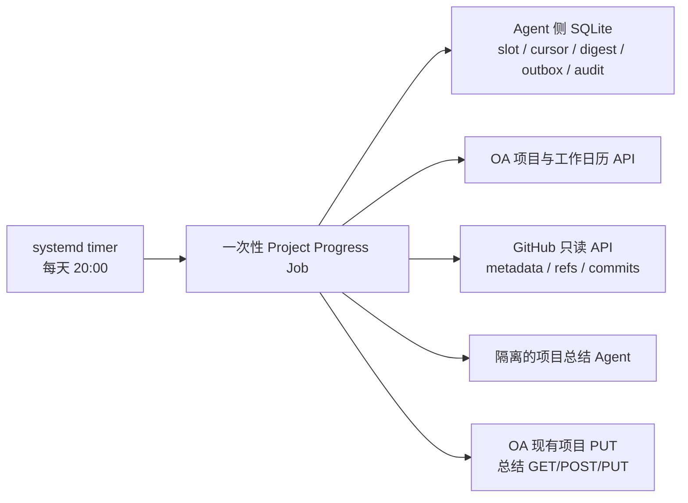
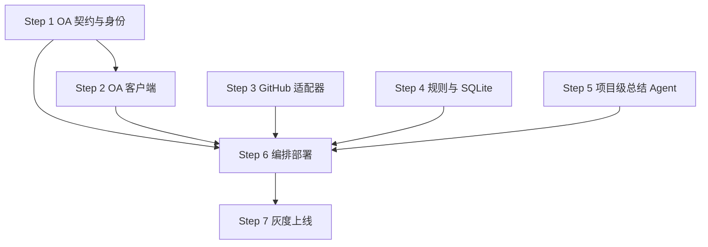

# GitHub 项目进度自动化实施蓝图

- 更新日期：2026-07-24
- 状态：已按 OA 新接口重构并通过独立反向审查
- 目标时区：`Asia/Shanghai`
- 当前仓库：`OAagent-codex`
- 契约基线：`agent/.context/openapi/openapi_json.json`
- 外部变更说明：`github_commit_ai_integration.md`

## 1. 目标与最终效果

在每个工作日 20:00 自动执行一次项目进度同步：

1. 通过 OA `GET /projects/list-by-project` 分页取得全部项目。
2. `status=archived` 的项目立即排除，不解析 `github_urls`，也不发起任何 GitHub 请求。
3. 对 `updating`、`maintenance` 项目的全部 `github_urls` 读取约定范围内的 commits。
4. 一个项目可以包含多个仓库；同一日期的所有仓库 commits 合并后只生成一条项目级总结。
5. 使用现有总结 CRUD，在 `(project_id, summary_date)` 唯一约束下创建或更新记录。
6. 项目任一仓库存在近期活动时状态为 `updating`；全部仓库连续 240 小时没有活动时状态为 `maintenance`。
7. 原为 `maintenance` 的项目出现新 commit 时，通过现有项目修改接口恢复为 `updating`。
8. 同步任务支持迟到 commit 补偿、重复运行幂等、局部失败隔离、审计和安全回滚。

这版方案直接使用 OA 已新增的 `status`、`github_urls` 和 GitHub Commit Summary 数据模型，不再要求 OA 新建另一套项目状态表或总结表。现有接口足以完成读取、dry-run 和单写者功能验证；生产自动写入前仍需补充最小 CAS/version、创建幂等键和服务身份契约，避免覆盖并发人工操作。

## 2. 已验证的 OA 契约

### 2.1 项目契约

| 能力 | 接口/字段 | 规划用法 |
| --- | --- | --- |
| 分页读取项目 | `GET /projects/list-by-project?page=1&size=100` | 任务入口，遍历所有项目 |
| 二次读取项目 | `GET /projects/project?project_id={id}` | 写入前重新确认状态和仓库列表 |
| 修改项目状态 | `PUT /projects/project?project_id={id}` | 只发送 `{ "status": "updating|maintenance" }` |
| 项目状态 | `status` | 允许 `updating`、`maintenance`、`archived` |
| 项目仓库 | `github_urls: string[]` | 一个项目可包含多个 GitHub 仓库 |

`is_archived` 已从新契约删除。实现中禁止继续读取或写入该字段。

### 2.2 总结契约

| 能力 | 接口 | 关键约束 |
| --- | --- | --- |
| 按项目/日期查总结 | `GET /projects/github-commit-summaries` | `project_id` 必填，`summary_date` 可精确过滤 |
| 查单条总结 | `GET /projects/github-commit-summary?summary_id={id}` | 用于写前核对和补偿 |
| 创建总结 | `POST /projects/github-commit-summary` | `project_id`、`summary_date`、`ai_confidence` 必填 |
| 更新总结 | `PUT /projects/github-commit-summary?summary_id={id}` | 部分更新，`project_id` 不可改 |
| 删除总结 | `DELETE /projects/github-commit-summary?summary_id={id}` | 自动任务不使用，仅保留人工运维能力 |

同一个 `project_id + summary_date` 只能有一条记录。多仓库项目必须先聚合再写入，不能按仓库分别创建总结。

创建 payload：

```json
{
  "project_id": 63,
  "summary_date": "2026-07-23",
  "summary": "今日完成登录流程优化并补充相关测试。",
  "ai_confidence": 86,
  "ai_note": "基于 2 个仓库的 8 条提交生成。"
}
```

更新时任务只发送 `summary`、`ai_confidence`、`ai_note`，不主动修改 `summary_date`。需要清空字符串时传 `""`，永远不传 `null`，以变更说明中的规则为准，即使当前 OpenAPI change schema 暂时声明 nullable。

### 2.3 已确认的契约差异与剩余缺口

- `agent/.context/openapi/openapi_json.json` 与 2026-07-24 在线 OpenAPI SHA-256 一致：`5d417df60c38c51115b86b918388fc4638d8061ea885d613369dd1d80568e2af`。
- 本地兜底 `agent/openapi/openapi.json` 仍是旧版本，仍包含 `is_archived`，发布前必须受控刷新并增加契约回归测试。
- 项目和总结接口的成功响应在 OpenAPI 中仍是空 schema `{}`；客户端必须运行时校验实际 envelope、`data.total`、`data.items`、项目字段和 summary ID，不能直接类型断言。
- OpenAPI 没有把 `status` 声明成 enum；客户端必须自行只接受 `updating|maintenance|archived`，未知值跳过并告警。
- 创建总结重复时返回 HTTP 400，目前没有 `Idempotency-Key`；本地 outbox 只能帮助恢复，不能证明超时后出现的记录一定由本 worker 创建。
- 总结记录没有 commit SHA、source digest、生成器版本或 managed-by 字段；这些同步元数据必须保存在 Agent 侧。
- 当前 Agent 的 OA 调用依赖用户 session cookie，后台任务没有独立服务凭证；生产启用前必须提供非人类 OA 机器人账号或最小权限长期服务 token。

### 2.4 生产自动写入前的最小 OA 契约补强

以下是现有新增接口上的兼容扩展，不是重建业务模型：

1. 项目详情/列表返回单调递增 `version`。
2. 项目状态更新接受 `expected_version`，服务端执行条件更新：版本必须匹配且当前 `status != archived`；冲突返回 409。这样旧 worker 永远不能把已归档项目改回 updating/maintenance。
3. summary 返回单调递增 `version` 和 `managed_by`。
4. summary POST 接受 `client_request_id`，在服务端唯一；同 key 重试返回同一记录，而不是仅依赖重复 400。
5. summary PUT 接受 `expected_version`，版本冲突返回 409；人工修改内容、日期或其他字段后，旧 worker 不能覆盖。
6. 提供独立项目同步服务身份及 scope，不复用人类用户 session；服务端对该身份只允许项目 status-only 修改、summary GET/POST/PUT 和工作日历读取，拒绝 DELETE、归档和其他项目字段修改。
7. 为项目和 summary 成功响应补 OpenAPI response schema，至少稳定声明 `id/status/github_urls/version/updated_at/managed_by` 和分页 envelope。

如果这些 CAS/幂等能力暂时不能提供，worker 只能运行 dry-run 或“生成待人工确认的写入建议”，不能宣称人工编辑安全、永不反归档或开启无人值守 PUT/POST。

## 3. 完整业务逻辑

### 3.1 项目筛选

1. 从 `page=1,size=100` 开始分页读取，直到达到响应 `data.total` 或最后一页 `items` 为空。
2. 对每条项目做运行时校验：`id` 为整数、`status` 是已知值、`github_urls` 是字符串数组。
3. `status=archived`：立即结束该项目处理，GitHub 请求数必须为 0，也不读取历史总结。
4. `status=updating|maintenance` 且 `github_urls=[]`：不修改状态、不创建空总结，记录 `no_github_urls` 数据质量告警。
5. 未知状态或响应字段缺失：隔离该项目，不把“解析失败”解释为“没有 commit”。
6. 每个候选项目在解析 URL 和第一次 GitHub 请求之前，立即调用 `GET /projects/project` 复核最新 `status/version/github_urls`；已 archived 时 GitHub 请求仍为 0，URL hash 变化时使用新详情重新规划。

“archived 零 GitHub 读取”保证基于 GitHub 调用前的最新 OA 详情快照。若要求管理员点击归档后立即取消已经开始的 GitHub HTTP 请求，还需要 OA 归档事件/取消通道；普通 GET API 无法提供跨系统瞬时强一致性。

### 3.2 GitHub URL 与仓库身份

- 仅接受规范化后的 `https://github.com/{owner}/{repo}`；允许输入末尾 `.git` 或 `/`，规范化时移除。
- 拒绝非 GitHub host、额外 path、query、fragment、空 owner/repo；无效 URL 使该项目本轮“不完整”。
- 同一项目重复 URL 规范化后去重。
- 首次读取仓库元数据后保存 GitHub immutable repository ID；以后 URL 改名时以返回 ID 识别同一仓库。
- 多个 OA 项目引用同一仓库时，一次运行只读取一次 GitHub，结果在内存中复用，但分别参与各自项目总结。
- OA 项目本身为 archived 时不进入 URL 解析器，因此不会因 URL 校验间接读取归档项目仓库。

### 3.3 commit 范围

- 第一版默认 `branch_scope=all-current-refs`：枚举运行时仍存在的全部 branch refs，跨分支按 SHA 去重。
- 如果产品只需要默认分支，必须明确把全局配置改为 `default-branch`，不能静默缩小“当天所有 commit”的含义。
- worker 保存每个 repository/ref 的 head SHA；ref 变化时通过 compare/history 取得新进入范围的 commits，并使用时间重叠窗口对账。
- `committed_at` 决定 `summary_date`，按 `Asia/Shanghai` 转换。
- 只有 `committed_at <= observed_at + allowed_clock_skew` 才视为可信，默认 `allowed_clock_skew=5m`。
- 超过允许偏差的未来 commit 标记 `timestamp_anomaly` 并告警：状态活动时间和 summary_date 都使用本次 `observed_at` 的保守值，绝不保存未来活动时间或创建未来日期总结；`ai_note` 说明异常数量。
- `first_seen_at` 只表示 worker 的观察/消费时间，用于 cursor 和补偿，不直接用于“10 天无 commit”判断。
- 无 webhook 时，项目活动时间使用约定 refs 中最新可信 `committed_at`；worker 宕机后补看到 14 天前的 commit，仍按 14 天前计算，不会错误续期 10 天。
- 有经过验证的 push webhook 时，可使用 push/进入 scope 时间作为活动时间，但必须与轮询模式明确区分并记录来源。
- 首次上线以约定 refs 的最新 `committed_at` 初始化仓库活动时间，只建立历史 head 基线，不把全部旧 commit 视为今天的新活动。
- 空仓库以 GitHub repository `created_at` 作为初始活动时间；创建满 240 小时仍无 commit 时才允许进入 maintenance。
- 只有当前 `github_urls` 中的仓库参与状态和总结；被移除仓库的本地 state 保留审计但不再参与计算。
- 纯轮询无法发现“当天创建并在运行前删除，且 commit 未被其他 ref 引用”的瞬时分支。若业务要求零遗漏，必须增加 GitHub App/per-repo push webhook；否则上线确认口径为“运行时当前 refs 可达的全部 commits”。

### 3.4 多仓库项目状态

项目活动时间是全部有效 `github_urls` 的最大可信 commit 活动时间；纯轮询模式取最新 `committed_at`，webhook 模式可取已验证 push time。

| 条件 | 状态动作 |
| --- | --- |
| 当前 OA 状态是 `archived` | 完全跳过，不调用 GitHub，不自动反归档 |
| 任一仓库发现 `last_activity_at > scheduled_at - 240h` | 目标状态为 `updating`，这是正向证据；即使其他仓库暂时失败，也允许 `maintenance -> updating` |
| 全部配置仓库成功读取，且最大活动时间 `<= scheduled_at - 240h` | 目标状态为 `maintenance` |
| 任一 URL 无效、无权限、限流或读取失败，且没有近期活动正向证据 | 保持现状，禁止降级为 `maintenance` |
| `github_urls=[]` | 保持现状并告警 |
| 全部为空仓库且创建均已满 240 小时 | 目标状态为 `maintenance` |

状态写入前重新调用 `GET /projects/project` 并使用 version CAS：

- 如果项目已变为 `archived`，取消所有待写操作。
- 如果 `github_urls` 发生变化，废弃当前项目结果并在下一 attempt 重算。
- 只有目标状态与当前状态不同时，才调用 `PUT /projects/project`，body 只包含 `status`，并携带 `expected_version`。
- 自动任务拥有 `updating/maintenance` 的规则计算权，但永远不能把 `archived` 改回其他状态。

### 3.5 项目级每日总结

对每个受影响的北京时间日期执行：

1. 从项目全部规范化仓库取得该日期完整 commit 集合，跨仓库使用 `repository_id + sha` 去重。
2. 任一仓库该日期窗口读取失败时，不生成“部分项目总结”；保留待重试状态。
3. 所有仓库 commits 总数为 0 时，不创建空总结。
4. 按 repository ID、SHA 稳定排序并计算 `source_digest`。
5. 本地记录已有相同 digest 时，不调用 Agent，也不写 OA。
6. digest 变化时，以完整集合重新总结；迟到 commit 更新旧日期时不能只总结增量。
7. 本地已有 managed `summary_id` 时，先调用单条 GET；404、日期被移动或当前 payload/version 与上次 applied 快照不一致，都标记 external edit，不自动重建或覆盖。
8. 本地没有 managed ID 时，查询 `GET /projects/github-commit-summaries?project_id={id}&summary_date={date}&page=1&size=2`。
9. `total=0`：先持久化带唯一 `client_request_id` 的 outbox intent，再 POST 创建；重试必须复用同一 key。
10. `total=1`：只有服务端 `managed_by/client_request_id` 证明属于本 worker，或经过人工 adoption 后，才进入更新判断。
11. `total>1`：视为 OA 唯一约束异常，停止该项目并告警。

未知来源的既有总结默认不自动覆盖。Agent 本地状态没有该 `(project_id,date,summary_id)`，且服务端没有匹配 `managed_by/client_request_id` 时标记 `unmanaged_existing_summary`，管理员确认 adoption 后才由 worker 接管，避免覆盖人工填写内容。

已由 worker 管理的记录在 PUT 前仍需调用单条查询：如果当前 `summary_date/summary/ai_confidence/ai_note/version` 与本地最近一次 applied payload 不一致，说明发生了外部编辑，标记 `external_summary_edit` 并停止自动覆盖，直到管理员重新 adoption。只有当前值仍等于 worker 上次写入值时，才携带 `expected_version` PUT 新摘要。

POST 返回错误或网络超时的恢复逻辑：

1. 使用项目和日期重新查询。
2. 只有唯一记录的 `client_request_id/managed_by` 匹配当前 intent，才记录为本次创建成功并接管其 `summary_id`。
3. 若存在相同 payload 但没有身份标记，仍视为 `ambiguous_existing_summary`，等待人工 adoption，不能因内容相同自动接管。
4. 若存在不同内容，标记冲突，不盲目 PUT。
5. 若仍不存在：超时、连接中断、5xx 等不确定结果可复用同一 client key 有限重试；确定性 HTTP 400 直接标记 non-retryable，不把所有 400 当作重复创建。

自动任务不调用 DELETE。错误总结的补偿方式是基于审计快照 PUT 回旧内容，且必须在人工预览后执行。

### 3.6 `ai_confidence` 与 `ai_note`

`ai_confidence` 使用程序计算的输入质量分，不直接相信模型自评：

- 完整读取全部仓库、commit message 清晰、未触发截断：基准 90。
- 大量 `fix`、`update` 等低信息提交：按比例降分。
- 文件统计或 commit 详情因 API/预算限制缺失：降分并在 `ai_note` 说明。
- 使用分块总结：轻微降分。
- 模型失败而使用确定性兜底：固定低分，例如 35。
- 最终值取 `0-100` 整数。

`ai_note` 只描述事实性限制和输入规模，例如“基于 2 个仓库 8 条提交；3 条提交说明较短”。没有限制时允许写 `""`。

### 3.7 工作日、业务日期与补偿

- `systemd timer` 每天 20:00 `Asia/Shanghai` 唤醒一次 Job。
- 推荐复用现有 `GET /weekly-report/days-by-month?month=YYYY-MM` 判断法定工作日和调休；由于成功响应 schema 为空，实施前必须捕获真实 fixture 并确认 holiday/workday 字段语义。
- 如果产品确认“工作日”仅表示周一至周五，可配置固定 weekday calendar，不调用周报日历接口。
- Job 只执行最新一个到期 business slot；更早遗漏 slot 标记为由最新 slot 补齐，避免旧 slot 晚到后覆盖新状态。
- 周末、节假日和 20:00 后的 commits 在下次工作日按真实 `summary_date` 补写或更新。

## 4. 推荐架构



关键边界：

- OA 是项目状态、仓库 URL 和最终总结的业务事实来源。
- Agent SQLite 是同步游标、repository ID、ref head、processed SHA、digest、租约、outbox 和补偿审计的技术事实来源。
- GitHub 只提供只读输入。
- 总结 Agent 不获得 GitHub/OA token、Shell、工具或网络。

当前生产 Compose 是单 Agent 主机，第一版允许一个 scheduler host 使用本地 SQLite。systemd service 使用 `flock` 保证同一主机只有一个 worker 进程；OA version CAS 负责最终防止陈旧进程覆盖。若以后部署多个 scheduler 主机，必须把 slot lease/outbox 状态迁移到共享 PostgreSQL/Redis；不能让多个本地 SQLite 实例同时写 OA。

## 5. Agent 侧状态模型

使用 Node 22 的 SQLite 能力，持久化到独立文件：

```text
PROJECT_PROGRESS_STATE_DB=/app/.context/project-progress.sqlite
```

Compose 已把 `/app/.context` 挂载为持久卷，但仍需加入备份和权限检查。

### 5.1 核心表

| 表 | 关键字段与用途 |
| --- | --- |
| `sync_slot` | `business_slot` 唯一、状态、attempt、租约、heartbeat、fencing token、caught_up_by |
| `project_state` | project ID、最后应用 slot、最近 OA status、`github_urls_hash`、最近结果 |
| `repository_state` | repository ID、canonical full name、最近活动、游标、最近错误 |
| `project_repository_state` | project ID + repository ID、membership epoch、加入基线、最后消费 first-seen 水位；共享仓库的 GitHub 事实可复用，但各项目独立消费 |
| `repository_ref` | repository ID、ref name、head SHA、首次/最近看到时间 |
| `processed_commit` | repository ID + SHA 唯一、committed/first-seen 时间、脱敏 subject、业务日期 |
| `project_daily_summary` | project ID + date 唯一、完整 source digest、OA summary ID、managed/adopted、最近 applied payload 与 OA updated_at |
| `oa_outbox` | 唯一 intent key、operation、target、payload digest、expected OA version、依赖 intent、状态、attempt、最后错误 |
| `mutation_audit` | OA 写入前后快照、slot、project、summary ID、补偿状态 |

### 5.2 正确性约束

- `project_state.last_applied_business_slot` 阻止旧 slot 回写状态和水位。
- `oa_outbox.intent_key` 唯一；同 slot、同 intent 重试返回既有结果，状态包含 pending/applied/conflict/non-retryable。
- outbox 明确前置条件和依赖顺序；项目/summary mutation 都携带 expected OA version，409 后重新读取而不是无条件重放。
- 每个 `project_repository_state` 独立保存加入基线和消费水位；项目失败、后绑定共享仓库或 URL 变更都不会被全局 repository cursor 吞掉。
- 只有 OA 写入被查询确认后，才把 digest/状态 mutation 标记 applied。
- `processed_commit` 的 SHA tombstone 长期保留；敏感 subject 按数据保留期清理。
- SQLite transaction 原子提交本地 cursor、digest 和 outbox 状态。
- Job 启动时先接管过期租约，再恢复 pending outbox，最后读取新 GitHub 数据。

## 6. OA 客户端调用映射

实现独立的 `ProjectProgressOaClient`，不要让通用聊天 Agent 通过 `callOaApi` 自主决定写操作。

| 客户端方法 | OA operationId |
| --- | --- |
| `listProjects` | `projects_list_projects_list_by_project_get` |
| `getProject` | `projects_projects_project_get` |
| `updateProjectStatus` | `projects_projects_project_put` |
| `listCommitSummaries` | `github_commit_summaries_projects_github_commit_summaries_get` |
| `getCommitSummary` | `github_commit_summary_projects_github_commit_summary_get` |
| `createCommitSummary` | `create_github_commit_summary_projects_github_commit_summary_post` |
| `updateCommitSummary` | `update_github_commit_summary_projects_github_commit_summary_put` |
| `getWorkdaysByMonth` | `weekly_report_days_by_month_weekly_report_days_by_month_get` |

调用规则：

- 每个请求都携带配置的 `alias=OA_AUTH_ALIAS`。
- 使用独立 `OA_PROJECT_SYNC_TOKEN`，按 `OA_PROJECT_SYNC_TOKEN_HEADER/OA_PROJECT_SYNC_TOKEN_PREFIX` 格式发送；该 token 不绑定用户聊天 session，也不复用用户 token header 配置。
- 所有响应经过手写或 schema validator 解码，错误 envelope、缺失 `data` 或字段类型错误都作为契约错误处理。
- PUT 项目状态前重新 GET 项目并携带 expected project version；PUT 总结前按 summary ID GET 单条并保存 before snapshot，携带 expected summary version 检测外部编辑冲突。
- change payload 不发送 `null`、`project_id` 或无关项目字段。
- DELETE operation 不暴露给自动编排器。

## 7. 总结 Agent 契约

专用输入按项目聚合：

```json
{
  "projectId": 63,
  "projectName": "Example Project",
  "summaryDate": "2026-07-23",
  "repositories": [
    {
      "fullName": "example/backend",
      "commits": [
        {
          "sha": "full-sha",
          "committedAt": "2026-07-23T09:10:00Z",
          "subject": "Optimize login redirect",
          "files": ["agent/src/auth.ts"]
        }
      ]
    }
  ]
}
```

Agent 只输出：

```json
{
  "summary": "完成登录跳转优化并补充相关测试。",
  "limitations": ["部分提交说明较短"]
}
```

程序再计算 `ai_confidence` 和生成 `ai_note`。

安全与质量要求：

- projectName、repository full name、commit subject、branch、作者和文件路径全部是不可信数据，提示词中只作为数据区。
- 默认不发送 commit body、patch、blob、邮箱或作者个人信息。
- 模型 provider 必须经过批准，满足私有代码的零数据保留/不训练、数据地域和保留期要求；项目可配置 summary opt-out。
- 模型无 Shell、工具、Web Search、网络和环境变量。
- 输入前做 Secret/PII 清洗和单条/总 token 上限。
- 输出做 JSON 校验、纯文本化、URL/HTML/mention 清洗和事实覆盖检查。
- 单次最多 50 commits；超过时分块汇总，最终仍只输出一条项目总结。
- 模型失败重试两次，仍失败时使用确定性摘要并降低 confidence。

## 8. 错误处理与恢复

| 失败点 | 行为 |
| --- | --- |
| 项目列表读取失败 | 整个 slot 失败，不发起 GitHub 或 OA 写入 |
| 项目 archived | 正常跳过，GitHub 请求为 0 |
| 一个项目 URL 无效 | 项目不完整；不生成总结、不降为 maintenance |
| 一个仓库 401/403/404/限流 | 项目不完整；不生成部分总结、不降级；其他项目继续 |
| 其他仓库发现近期 commit | 即使某仓库失败，允许凭正向证据把 maintenance 提升为 updating |
| 总结 Agent 失败 | 使用确定性兜底，低 confidence 和明确 ai_note |
| 总结查询失败 | 不 POST/PUT，不标记 digest applied |
| POST 确定性 400 | 重查仍无匹配 client key 时 non-retryable，不盲目重 POST |
| POST 超时/5xx | 复用同一 client_request_id 重试；匹配 key 才自动接管 |
| POST 后出现无身份标记的相同内容 | ambiguous，不自动 managed，等待 adoption |
| OA status PUT 失败 | outbox 保持 pending，下次先重试；不重复调用 Agent |
| 项目/summary CAS 409 | 重新读取并重算；若 archived 或人工编辑则进入 conflict，不无条件重放 |
| 项目写前变 archived | 取消 status 和 summary 写入，不自动反归档 |
| SQLite 损坏/丢失 | 停止自动写入，恢复备份；不得在无 managed/digest 状态下覆盖已有总结 |

状态写和总结写无法构成一个服务端事务，因此采用本地 outbox + 可重放 reconciliation。允许某个写入先成功，但 slot 只有在所有必需 outbox operation 被查询确认后才完成；每个单独 mutation 必须依赖 OA CAS/version 保证不会覆盖并发人工操作。

## 9. 鉴权与 Secret

- `OA_PROJECT_SYNC_TOKEN`：非人类 OA 机器人/服务身份，最小权限仅限项目读取、项目状态修改、总结创建/更新、工作日历读取，不授予 DELETE。
- `OA_PROJECT_SYNC_TOKEN_HEADER` / `OA_PROJECT_SYNC_TOKEN_PREFIX`：项目同步专用 header 格式，不复用面向用户 session 的 `OA_API_TOKEN_HEADER/PREFIX`；可独立配置 Bearer 或其他服务鉴权。
- `PROJECT_PROGRESS_GITHUB_TOKEN`：单 resource owner 时使用 fine-grained PAT，仅 `Metadata: Read`、`Contents: Read`。
- 跨多个 GitHub owner 时使用 GitHub App installation token，或按 owner 路由多枚 fine-grained PAT；不能用开发者本机 `gh` token。
- `PROJECT_PROGRESS_STATE_DB`：SQLite 路径，不包含 token。
- Secret 只进入 worker 进程环境，不进入 prompt、SQLite payload、日志、项目总结或审计 before/after。
- 生产启用前必须验证 OA token 的生命周期、轮换方式和数据范围：能分页读取全部目标项目，但不能 DELETE 总结、归档项目或修改无关项目字段；长期复用人类 session cookie 不通过安全验收。

## 10. 分步实施计划

每一步以一个可独立回滚的 PR 为目标。当前工作区已有其他未提交修改，实施时使用干净分支或独立 worktree，避免覆盖用户改动。

### Step 1：锁定 OA 契约与后台身份

- 依赖：无
- 可并行：完成契约后解锁 Step 2；可与 Step 3、4、5 的纯本地开发并行
- 模型档位：最强模型
- 目标仓库：OA 后端仓库（当前 workspace 外）与当前仓库的 fallback OpenAPI/tests

上下文简报：运行时 OpenAPI 已包含新字段和总结 CRUD，但本地 fallback 仍旧，成功响应 schema 为空，写接口没有 CAS/idempotency，后台身份尚未提供。先在 OA 后端做兼容补强，再锁定 Agent 契约。

任务：

1. OA 项目和 summary 增加 version；项目 status PUT 和 summary PUT 增加 expected version、条件更新与 409。
2. OA summary POST 增加唯一 client_request_id 和 managed_by；同 key 重试返回同一记录。
3. OA 增加项目同步服务身份/scope，禁止 DELETE 和无关项目修改。
4. 为成功响应补 OpenAPI schema，然后受控刷新 `agent/openapi/openapi.json`，保留远程优先、本地 fallback 策略。
5. 为 status、github_urls、version、summary create/change、client key 和 operationId 增加契约快照测试。
6. 在测试环境捕获项目列表、项目详情、总结列表/详情、创建/更新/冲突和工作日历的真实脱敏响应 fixture。
7. 确认 status-only CAS PUT 不会清空其他字段，且 archived 条件更新必定 409。
8. 申请并验证独立 token/header/prefix；如果后台只能签发用户 cookie，先补服务身份能力再继续生产实施。

验证：

- 在 OA 后端仓库运行其现有 migration、unit、integration 和 OpenAPI 测试命令，并把实际命令/结果写入 PR。
- `npm exec --workspace=agent -- tsx --test test/openApiContract.test.ts`
- `npm run typecheck -w agent`
- `jq -e '.components.schemas.ProjectChangeInModel.properties | has("status") and has("github_urls")' agent/openapi/openapi.json`
- `jq -e '.paths | has("/projects/github-commit-summary")' agent/openapi/openapi.json`
- 测试环境对一个专用项目执行 status-only PUT，确认名称、成员、描述和 github_urls 不变。
- 在 GET 与 PUT 之间归档项目，断言 worker 的旧 expected version 返回 409，状态仍 archived。
- 人工编辑 summary 后用旧 expected version PUT，断言 409 且人工内容不变。
- 相同 client_request_id POST 两次，断言返回同一 summary ID。

退出标准：fallback 与在线契约一致；CAS/idempotency 有数据库并发测试；响应 fixture 可稳定解码；后台 token 具备最小权限和轮换方案；status-only PUT 已验证不会反归档。

回滚：恢复旧 fallback 只允许在新功能未启用时进行；一旦 worker 上线，不得回滚到缺少新接口的契约。

### Step 2：实现类型安全的 OA 项目同步客户端

- 依赖：Step 1 契约
- 可并行：与 Step 3、4、5 并行
- 模型档位：默认模型

上下文简报：新增专用客户端，严格封装项目读取、status-only PUT 和总结 query/create/update；不复用用户聊天 session 或通用 Agent 写工具。

建议文件：

- `agent/src/infrastructure/oa/projectProgressOaClient.ts`
- `agent/src/infrastructure/oa/projectProgressSchemas.ts`
- `agent/test/projectProgressOaClient.test.ts`

任务：

1. 实现分页项目列表、项目详情和工作日历读取。
2. 实现 status-only PUT、expected project version、409 分类和写前二次确认。
3. 实现项目+日期精确查总结、单条查询、带 client key POST、带 expected summary version PUT。
4. 实现空 schema 响应的运行时 decoder 和错误分类。
5. 实现 POST 确定性 400、超时/5xx、CAS 409 的独立错误类型；冲突决策交给编排器。
6. 保证 update payload 不发送 null、project_id、summary_date 或无关字段。

验证：

- `npm test -w agent`
- `npm run typecheck -w agent`
- 分页超过 100 项目 fixture 必须完整返回。
- malformed envelope、未知 status、重复 summary、POST 超时等 fixture 必须得到明确错误类型。
- archived 项目在客户端上层过滤测试中不得产生 GitHub 调用。

退出标准：所有 OA 调用都有类型解码和 fixture；不存在用户 session 依赖；自动客户端不暴露 DELETE。

回滚：关闭 project progress feature flag；专用客户端不影响现有聊天 API。

### Step 3：实现多仓库 GitHub 只读适配器

- 依赖：无
- 可并行：与 Step 2、4、5 并行
- 模型档位：默认模型

上下文简报：适配器接收经过 OA status 过滤后的 github_urls，负责 URL 规范化、repository ID、refs、compare/history、分页、限流和跨分支 SHA 去重。

建议文件：

- `agent/src/infrastructure/github/githubClient.ts`
- `agent/src/infrastructure/github/githubUrl.ts`
- `agent/src/infrastructure/github/githubTypes.ts`
- `agent/test/githubClient.test.ts`

任务：

1. 实现严格 GitHub URL parser 和 canonicalizer。
2. 实现仓库元数据、全部 refs/default branch、compare/history 和 commit detail 读取。
3. 处理分页、401/403/404/429、rate-limit reset、超时和 5xx。
4. 支持同仓库跨项目的运行内缓存和 repository ID 去重。
5. 使用 fake HTTP server 测试，不在单测调用真实 GitHub。

验证：

- `npm test -w agent`
- `npm run typecheck -w agent`
- 覆盖 `.git`、尾 `/`、恶意 host、额外 path/query 和重复 URL。
- 覆盖多分支相同 SHA、新分支、删除分支、force-push、仓库改名和两页以上 commits。
- OA archived fixture 下 GitHub client 调用总数必须为 0。

退出标准：适配器只读、无 OA/Agent 依赖；全部错误可分类；不会读取 archived OA 项目仓库。

回滚：移除适配器或关闭 feature flag，对现有 Agent 无影响。

### Step 4：实现领域规则、SQLite 状态与 slot 租约

- 依赖：无
- 可并行：与 Step 2、3、5 并行
- 模型档位：最强模型

上下文简报：现有 OA API 没有 digest、cursor、lease 和 managed-by 字段，这些正确性状态由 Agent 侧 SQLite 承担。生产镜像是 Node 22.17，应同步 Node engines/@types 后使用受支持的 SQLite API。

建议文件：

- `agent/src/domain/projectProgress.ts`
- `agent/src/infrastructure/persistence/projectProgressStore.ts`
- `agent/test/projectProgress.test.ts`
- `agent/test/projectProgressStore.test.ts`

任务：

1. 定义 migration/version 和 9 张核心表。
2. 实现 atomic transaction、租约、heartbeat、fencing、stale takeover 和最新 slot 防倒退。
3. 实现 240 小时状态规则、多仓库完整性规则、未来 committed_at 校验和北京时间分组。
4. 实现项目级 repository membership 水位、digest、managed/adopted summary、带 expected version 的 outbox、pending 恢复和 mutation audit。
5. 实现 SQLite 备份、损坏检测和启动前权限检查。

验证：

- `npm test -w agent`
- `npm run typecheck -w agent`
- fake clock 覆盖 239:59:59、正好 240 小时、超过 240 小时。
- 覆盖未来 1 天/1 年 commit：使用 observed_at 保守处理，不延长超过 240 小时、不创建未来 summary_date。
- 模拟崩溃、陈旧租约接管、旧 slot 晚到、SQLite transaction 回滚和 pending outbox 恢复。
- 同 project/date digest 不变时断言不产生新 intent。

退出标准：所有状态规则为纯函数；SQLite 可迁移/备份/恢复；旧 slot 和旧 fencing token 不能回写。

回滚：先停 worker 并备份 SQLite，再回滚代码；不删除状态库，便于重放和审计。

### Step 5：实现项目级总结 Agent

- 依赖：无
- 可并行：与 Step 2、3、4 并行
- 模型档位：最强模型

上下文简报：总结单位已由“仓库+日期”改为“项目+日期”，输入可能来自多个仓库。Agent 只生成 summary 和 limitations，confidence 由程序计算。

建议文件：

- `agent/prompts/project-progress-summary.md`
- `agent/src/application/projectProgressSummarizer.ts`
- `agent/test/projectProgressSummarizer.test.ts`

任务：

1. 定义多仓库输入、结构化输出和运行时 validator。
2. 实现输入清洗、token/字节预算、50 commits 分块和最终聚合。
3. 实现 deterministic confidence、ai_note 和模型失败兜底。
4. 建立正常、多仓库、模糊消息、超长、Secret/PII 和 prompt injection 测试集。

验证：

- `npm test -w agent`
- `npm run typecheck -w agent`
- 两个仓库 fixture 最终只返回一条项目总结。
- 模型输出恶意 URL/HTML/mention 时被清洗或回退。
- 模型不可用时仍返回低 confidence 的确定性结果。

退出标准：相同输入产生结构稳定结果；不泄露 Secret/PII；不会为每个仓库分别生成 OA 记录。

回滚：切换 `deterministic-only`，不阻断 GitHub 状态同步。

### Step 6：编排 Job、定时器与部署

- 依赖：Step 2、3、4、5
- 可并行：不可
- 模型档位：最强模型

上下文简报：编排器把 OA 项目、多仓库 GitHub 读取、项目级总结、SQLite outbox 和现有 OA 写接口串联起来；服务端无跨接口事务，因此必须按可重放状态机实现。

建议文件：

- `agent/src/application/syncProjectProgress.ts`
- `agent/src/runtime/projectProgressSync.ts`
- `agent/test/syncProjectProgress.test.ts`
- `compose.yml`
- `scripts/project-progress-sync.service`
- `scripts/project-progress-sync.timer`
- `docs/project-progress-sync-operations.md`

任务：

1. 实现 project list -> archived filter -> URL normalize -> GitHub collect -> status decision -> summary reconcile。
2. 每个项目在 URL 解析/GitHub 调用前复核 OA 详情；失败隔离，任一仓库失败时不生成部分总结、不做 maintenance 降级。
3. 写 OA 前再次 GET 项目，使用 expected version 处理 archived/URL 变化竞态。
4. 实现 unmanaged/ambiguous existing summary adoption、按 ID 检测日期移动/删除/外部编辑、client key POST 恢复、CAS 409 和 pending outbox 重放。
5. 增加 `--dry-run`、`--project-id`、`--business-slot`、`--adopt-summary-id`、`--retry-pending`。
6. Compose 增加一次性 job profile，明确挂载与 agent 相同的 `agent_sessions:/app/.context` named volume、相同 node UID 和读写权限；systemd 每天 20:00 唤醒并用 `flock` 保证单实例。
7. 加入独立 OA token header/prefix 配置、feature flag、kill switch、指标、脱敏日志和 SQLite 备份操作手册。

验证：

- `npm test -w agent`
- `npm run typecheck`
- `npm run build`
- `npm run test:deploy`
- `docker compose --profile project-progress config`
- 多仓库同日 commits 只产生一条 OA summary create/update。
- archived 项目 GitHub 请求为 0；一个仓库失败时不生成部分总结。
- POST 超时后只有匹配 client_request_id/managed_by 的记录可接管；无身份记录即使 payload 相同也进入 ambiguous 冲突。
- 已管理 summary 被人工修改后，后续 digest 变化也不得自动覆盖，必须重新 adoption。
- 已管理 summary 被人工改日期或删除后，按 ID GET 检测为 external edit，不自动 POST 重建。
- 删除/recreate job 容器后，cursor、managed summary 和 pending outbox 仍存在；完成一次真实备份恢复演练。
- 旧进程持锁时第二个 systemd/job 实例无法进入；OA CAS 仍能拒绝陈旧 expected version。
- 同日迟到 commit 重新总结完整集合，不丢早先 commits。
- 旧 slot、重复 timer 和 Job 崩溃重启不会重复创建记录或回退状态。

退出标准：fake OA + fake GitHub + fake model 的端到端测试通过；所有 OA mutation 可重放；单项目失败不影响其他项目。

回滚：打开 kill switch，停止 service/timer，保留 SQLite 和 OA 审计；需要恢复错误内容时先预览 before snapshot，再人工确认 PUT 补偿。

### Step 7：影子运行、灰度与正式启用

- 依赖：Step 6
- 可并行：不可
- 模型档位：最强模型负责发布评审

上下文简报：先验证项目分页、多仓库聚合、status-only PUT 和总结 CRUD，再逐步开启生产写入，避免覆盖现有人工总结或误改 archived 项目。

任务：

1. 测试环境完成真实 OA/GitHub E2E，专门验证多仓库项目。
2. 生产运行 5 个工作日 dry-run，输出状态目标、项目日期 digest、预计 summary payload，但不写 OA。
3. 人工处理 `unmanaged_existing_summary`，决定保留、adopt 或一次性替换。
4. 第一阶段只开启状态写入，观察 2 个工作日。
5. 第二阶段对白名单项目开启总结写入，抽检 confidence/note 和事实一致性。
6. 全量开启前演练 token 轮换、SQLite 恢复、pending outbox 重放和错误 summary 补偿。

验证：

- OA 项目总数、archived 数、无 URL 数与 dry-run 报告一致。
- 所有 archived 项目 GitHub 请求总数为 0。
- 抽检至少 10 个项目日期，其中至少 3 个多仓库项目。
- 相同项目/日期重复运行只有一条 OA 记录。
- 手工修改/未知来源总结不会被默认覆盖。
- OA token、GitHub token、私有 commit 文本不出现在日志、SQLite intent 或 summary note。

退出标准：连续 5 个工作日没有归档误读、部分总结、重复记录、错误降级、越权或 Secret 泄漏；产品负责人批准全量。

回滚：先关闭总结写入，再关闭状态写入并停止 job；保留 OA 记录和 SQLite 审计，按项目/日期逐条补偿，不自动 DELETE。

## 11. 依赖图与并行波次



推荐波次：

1. 波次 A：Step 1；同时启动 Step 3、4、5 的纯本地工作。
2. 波次 B：Step 2 与 Step 3、4、5 并行收尾。
3. 波次 C：Step 6 集成和部署。
4. 波次 D：Step 7 影子、灰度、全量。

## 12. 验收矩阵

| 场景 | 预期结果 |
| --- | --- |
| `status=archived` | GitHub 请求 0，状态/总结写入 0 |
| 一个项目配置两个仓库 | 当天 commits 合并为一条项目 summary |
| 两个项目共享一个仓库 | GitHub 事实复用，但项目消费水位独立，不漏总结 |
| 两仓库出现相同 SHA | 按 repository ID + SHA 正确处理，不错误重复 |
| `github_urls=[]` | 不改状态、不建空总结，产生告警 |
| 空仓库创建未满/已满 240 小时 | 未满保持 updating，已满可转 maintenance |
| 一个 URL 无效或仓库 403 | 不生成部分总结，不降 maintenance |
| 一个仓库有近期 commit、另一个失败 | 允许 maintenance -> updating，不生成部分总结 |
| 全部仓库 240 小时无活动 | updating -> maintenance |
| 正好 240 小时 | 进入 maintenance |
| worker 停机 15 天后发现 14 天前 commit | 按 committed_at 判断，不把 first_seen 当今天活动 |
| commit 时间在未来 1 天/1 年 | 标记异常，按 observed_at 处理，不创建未来 summary_date |
| maintenance 项目出现新 commit | 恢复 updating，并生成项目级总结 |
| 当天无 commit | 不创建空 summary |
| 20:00 后出现 commit | 下个工作日更新真实 summary_date 的完整总结 |
| digest 未变化 | 不调用 Agent，不 PUT OA |
| 相同 client_request_id 重复 POST | 返回同一 OA summary ID |
| POST 确定性 400 | 记录 non-retryable，不盲目重试 |
| POST 超时/5xx | 同 client key 安全重试 |
| POST 后出现无身份相同内容 | ambiguous，不自动接管 |
| 已有未知来源 summary | 默认不覆盖，等待 adoption |
| 已管理 summary 被外部编辑 | 标记冲突，不覆盖，等待重新 adoption |
| 已管理 summary 被改日期/删除 | 按 summary ID 检测冲突，不自动重建 |
| 更新 summary | 不发送 project_id、summary_date 或 null |
| 写前项目变 archived | 取消所有待写，不反归档 |
| GET 后、PUT 前项目被归档 | expected version 409，服务端 SQL 拒绝反归档 |
| GET 后、PUT 前 summary 被人工编辑 | expected version 409，人工内容保留 |
| OA 响应字段错误 | 契约错误，保持原状态和水位 |
| 旧 fallback 被使用 | 仍能识别 status/github_urls/summary CRUD |
| Job 崩溃 | 租约过期后恢复 pending outbox，不重复创建 |
| Job 容器删除重建 | 同 named volume 中 SQLite/cursor/outbox 仍存在 |
| 旧 slot 晚到 | 被 last_applied slot 拒绝，不回退状态 |
| 模型失败 | 低 confidence 确定性总结，ai_note 说明 |
| SQLite 丢失 | 自动写入停止，不覆盖既有 summary |

## 13. 上线前必须确认的决策

1. “所有 commits”是所有当前 refs，还是仅默认分支；若包含瞬时已删除分支，需要 webhook 权限。
2. “工作日”是否采用 OA 法定节假日/调休日历，还是固定周一至周五。
3. OA 后台能否提供独立、可轮换、最小权限的 `OA_PROJECT_SYNC_TOKEN`。
4. GitHub 仓库是否跨多个 resource owners；这决定单 PAT、多 PAT 还是 GitHub App。
5. 既有同日 summary 的 adoption 策略，默认选择“不自动覆盖”。
6. `ai_confidence` 是否接受程序化质量分；本方案不使用模型自报概率。
7. “10 天”按滚动 240 小时计算，而不是 10 个北京时间自然日。

## 14. 反模式清单

- 继续读取已删除的 `is_archived`。
- 为每个 github_url 分别创建 OA summary。
- archived 状态判断放在 GitHub 请求之后。
- 一个仓库失败时仍写“完整项目总结”或把项目降为 maintenance。
- 只用增量 commit 覆盖已有日期总结。
- 只看 POST 400 就盲目 PUT 未知来源记录。
- 根据 payload 相同就自动接管没有 client_request_id/managed_by 的记录。
- 把 unknown existing summary 当成本 worker 管理的数据。
- 忽略已管理 summary 的外部编辑，直接用新 digest 覆盖人工修改。
- 在 update body 发送 null、project_id 或无关项目字段。
- 把 response schema `{}` 当成可信对象直接使用。
- 使用聊天用户 cookie 或开发者本机 gh token 跑定时任务。
- 让 commit message 进入可调用工具的通用 Agent。
- SQLite 丢失后无审计地重建并覆盖 OA 总结。
- 多 scheduler 主机各用本地 SQLite 并发写 OA。
- 认为本地 fencing token 能替代 OA version CAS。
- 新 job service 没有挂载持久 `.context` named volume。
- 自动 DELETE 错误 summary，而不保留审计和人工确认。

## 15. 计划变更记录

- 2026-07-30：OAagent 增加自动化专用模型目录与校验接口，使用独立 `OA_AGENT_AUTOMATION_TOKEN`；Worker 支持按 `model_provider/model_id/model_parameters` 动态选择 Nexttoken 或 OpenRouter 模型，非法配置直接失败。OA 任务 claim/heartbeat/result/audit 客户端等待 OA 最终 OpenAPI 后接入，期间 systemd timer 仍是唯一调度来源。
- 2026-07-23：创建第一版跨 OA/Agent 蓝图。
- 2026-07-24：根据 OA 新增 `status`、`github_urls` 和 GitHub Commit Summary CRUD 重构。删除不再需要的 OA 状态/总结表重建计划；改为项目级多仓库聚合、现有 API GET/POST/PUT、Agent SQLite 状态/outbox、既有总结 adoption 和 status-only PUT。
- 2026-07-24：完成三轮独立反向审查。明确现有接口可用于读取/dry-run，但生产自动写入前必须补 project/summary version CAS、archived 条件更新、summary client_request_id/managed_by 和独立服务身份；同时补齐共享仓库项目级水位、外部编辑/删除检测、持久卷/flock、未来 commit 时间校验。当前无未处理 Critical/High。
